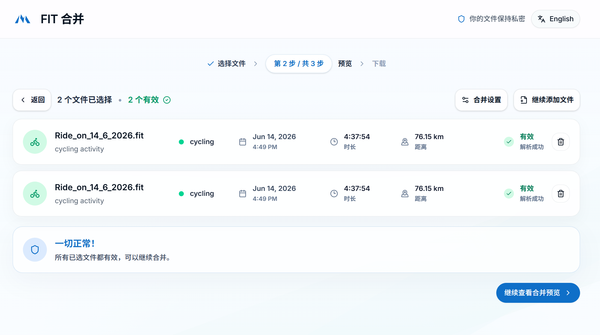
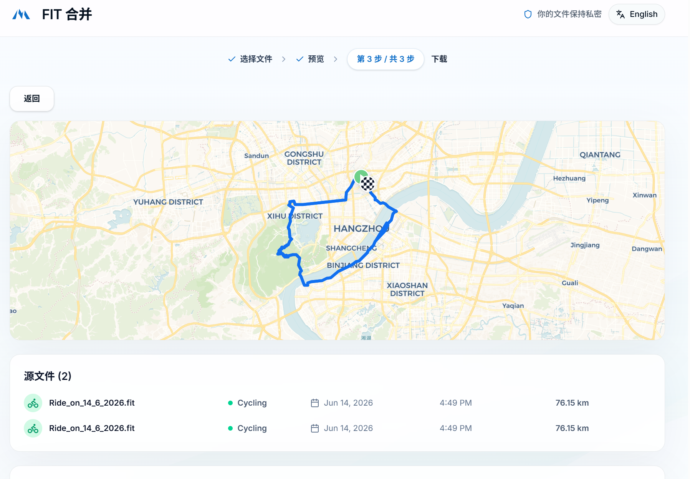

# FIT 合并

一个在浏览器本地运行的 FIT 文件合并工具，用于把多个 Garmin、Polar 或 Suunto 设备导出的 `.fit` 活动文件合并成一个干净的新 FIT 文件。

应用采用清晰的三步流程：选择文件、检查预览、下载结果。所有解析和合并都在用户浏览器中完成，文件不会上传到服务器。

## 界面预览

### 1. 选择 FIT 文件

拖拽或选择一个或多个 FIT 文件。页面会明确提示文件在浏览器本地处理，并支持一次选择多个活动文件。


### 2. 检查已选文件

应用会解析每个文件，并展示运动类型、日期、时长、距离和解析状态。只有有效文件才能继续进入合并预览。



### 3. 预览合并后的活动

合并前可以查看路线地图和源文件列表，确认活动内容无误后再下载新的 FIT 文件。



## 功能特性

- 合并多个 `.fit` 活动文件
- 支持 Garmin、Polar、Suunto 等常见设备导出的 FIT 数据
- 在浏览器本地解析和合并，保护个人运动轨迹隐私
- 解析后展示活动类型、开始时间、时长和距离
- 合并前预览路线地图和源文件列表
- 支持继续添加文件、删除文件和调整合并设置
- 导出新的合并后 FIT 文件
- 支持中文和英文界面切换

## 使用方式

1. 打开应用后，拖入或选择至少 2 个 FIT 文件。
2. 在文件检查页确认每个文件都解析成功。
3. 查看合并后的路线预览。
4. 下载新的 FIT 文件。

## 本地开发

安装依赖：

```bash
npm install
```

启动开发服务器：

```bash
npm run dev
```

生产构建：

```bash
npm run build
```

预览构建产物：

```bash
npm run preview
```

## 验证与检查

运行 ESLint：

```bash
npm run lint
```

使用 `sample_data/` 中的示例文件验证合并逻辑：

```bash
npm run test:sample-merge
```

## 项目结构

```text
src/
  App.tsx                 主应用界面与流程状态
  components/             上传、文件列表、地图和合并设置组件
  components/ui/          shadcn/Radix 风格的 UI 基础组件
  hooks/                  React hooks
  lib/                    FIT 解析、坐标处理、合并和 i18n
  styles/                 主题与共享样式
sample_data/              示例 FIT 文件
scripts/                  验证脚本
docs/images/              README 使用的实际应用截图
```

## 隐私说明

FIT 文件通常包含运动轨迹、时间和设备记录。这个项目的核心原则是本地优先：文件解析、路线预览和合并导出都在浏览器中完成，不需要把原始 FIT 文件上传到远程服务。

## License

本项目基于 MIT License。详见 [LICENSE](LICENSE)。
